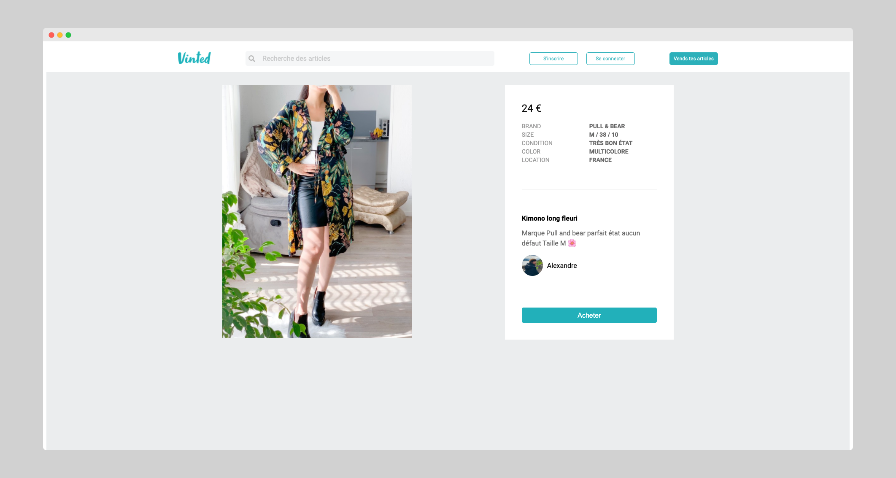
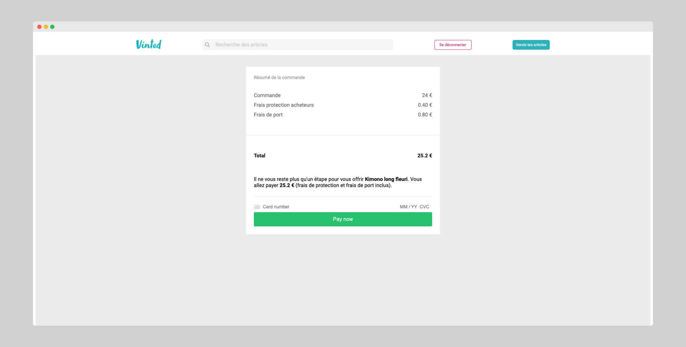

# Vinted Clone - React/Next.js

<div align="center">

<br />
  <br />
  <a href="https://vinted-frontend.vercel.app/" target="_blank" rel="noreferrer" >Live site (Vercel deploy)</a>
  <br />
  <br />
<a href="https://github.com/Alexandrebelin/Vinted-backend" target="_blank" rel="noreferrer" >Backend repository</a>
<br />
<br />

### Stack & Features

Website built with [Next.js](https://nextjs.org/) using [`create-next-app`](https://github.com/vercel/next.js/tree/canary/packages/create-next-app).. The backend is developed with [Node JS](https://github.com/Alexandrebelin/Vinted-backend) and the database uses Mongo DB.

**Login and purchase:**


<br />
<br />
<br />

**Searching for an article:**


<br />
<br />
<br />

**Publish an article:**


<br />
<br />
<br />


### Main dependencies

 Stripe (payment)
 <br />
 Axios (API requests)
 <br />
 cookie (cookie management)
 <br />
 react-cookie (cookie management)
 <br />
 next-image (file upload)
 <br />
 Fontawesome (icons)

### Main features

Login and Signup
<br />
Search
<br />
Publish an offer
<br />
Pay and buy with Stripe

## Screenshots

<div align="center">

**Offer page:**


<br />
<br />

**Checkout (payment with Stripe):**

</div>

## Getting Started

First, run the development server:

```bash
npm run dev
# or
yarn dev
```

Open [http://localhost:3000](http://localhost:3000) with your browser to see the result.
